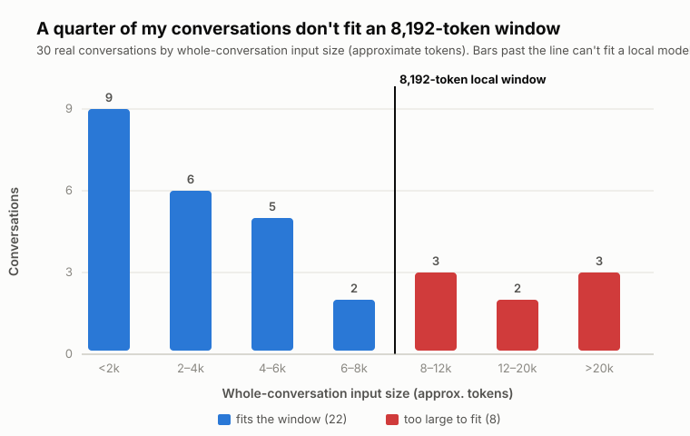
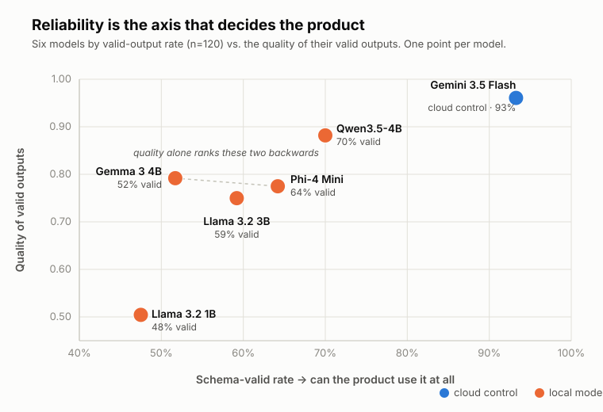

# Local LLMs Can Do the Job — Most of the Time

*I tested 5 small local models on 120 real work tasks. The best matched cloud quality — 70% of the time.*

Small language models are quietly showing up everywhere — including on the laptop I already own.
So I asked a plain question: **are they good enough to build a real product on yet?** I ran five
small local models and one hosted cloud model over the same 120 enrichment tasks from my own
work, under the same strict output contracts. When the best local model succeeded, I often
couldn't tell its output from the cloud's. Roughly a third of the time, it produced nothing my
product could use. Most write-ups only show you the first half.

## The one lesson, and its consequences

Here is the whole article in one line: **for a real product, the axis that matters is
reliability, not quality — and reliability is where local models lose.** The best local model
(Qwen3.5-4B, quantized, on an ordinary laptop) returned schema-valid output in **84 of 120
cases (70.0%)**, against **112 of 120 (93.3%)** for the hosted cloud control. Everything else I
learned is a consequence of taking that number seriously:

1. **Reliability is the first-order product metric.** A model that answers brilliantly 70% of
   the time is a 70% model. (This is the point; 2–5 follow from it.)
2. **Never average only the survivors.** Quality-of-successful-outputs hides failures; score
   failures as zero and they can't hide.
3. **Right-size what you send before growing what the model accepts.** Input size, not model
   intelligence, decided the one task local models did well.
4. **Match model class to workload shape.** Laptop-class 4B inference is a batch tool: backfill
   takes days, daily upkeep takes minutes, interactive is out of reach.
5. **The honest fix isn't a cloud escape hatch — it's making local itself good enough.** More
   on that at the end.

## Why I did this

I run several AI tools in parallel: Windows Copilot for quick questions, Claude and Claude Code
for deeper thinking and coding, ChatGPT for broader work and writing, Codex for development
tasks. My work is scattered across all of them, and I couldn't find a good way to keep track of
it across tools. So I'm building one.

**Chat Chronicle** is an open-source, local-first archive that ingests my AI chat histories
into SQLite with full-text search, then enriches each conversation with AI. Local-first for two
reasons that both matter: **privacy** — my history never leaves the machine — and **zero
marginal cost** — no per-token bill to enrich thousands of old conversations. Small models are
already running quietly on that machine, inside tools I use every day, so the obvious question
was whether the ones I can run locally are good enough to power the enrichment. I measured.

Repo: https://github.com/TzurV/mcp-chat-chronicle

## The four tasks (and why they're not a rigged difficulty ladder)

These are the **first four enrichment tasks I plan to add** once this research phase is done —
they aren't shipping yet, and I did not design them to trip up small models. This evaluation is
what tells me whether local inference can power them at all:

- **Summary** — 2–5 factual sentences describing what the conversation was about and where it
  landed.
- **Work-mode classification** — is this conversation mostly *managing* (planning, delegating,
  reviewing), *executing* (building, debugging), a *one-off* question, or *mixed*?
- **Last activity** — what was worked on most recently, its status (in progress / blocked /
  awaiting input / completed), and a supported next action.
- **Title assessment** — does the stored title still fit the conversation, and if not, suggest
  a better one.

Each is bound to a **strict JSON schema** — the product only stores schema-valid output. One
detail matters for everything below: **three of these four tasks feed the whole conversation as
context; only "last activity" sends just the recent tail.** Hold that thought.

## The context wall, before any model runs

Here is the distribution of my 30 conversations by input size, against the 8,192-token window
every local model ran at:

*Whole-conversation input size (approximate tokens), n=30. Everything to the right of the line
cannot fit an 8,192-token window.*

Read the bars against that line: **about a quarter of my real conversations are simply larger
than the window** — some of them far larger. The cloud control's window is far bigger, so it
never hit this wall. This is not a subtle effect I had to tease out of the scores; it's a
structural limit you can see before a single model runs. The one task that reads only the
recent tail of a conversation stays comfortably under the line for **all 30** — remember that
when we get to which task local models actually did well.

## The setup, briefly

**30 real conversations from my own archive × 4 tasks = 120 identical cases per model.** Five
local models via LM Studio, all Q4_K_M quantized, all at that fixed 8,192-token context, single
worker, on a 4-core/8-thread 11th-gen Intel mobile CPU with 32 GB RAM and integrated graphics:
Qwen3.5-4B, Phi-4 Mini, Llama 3.2 3B, Gemma 3 4B, and Llama 3.2 1B as the small floor. Plus
**Gemini 3.5 Flash (Vertex AI) as the cloud control** — a practical quality ceiling to measure
against, not an answer key (it produced 8 invalid outputs of its own). Every schema-valid
output was scored 1–4 on task-specific dimensions by a fixed hosted judge (Gemini 3.1 Pro
Preview, temperature 0), blinded to which model produced it.

On measurement discipline: **strict schema validation of outputs, temperature 0, and no content
retries** — if a model produced invalid JSON or broke the schema, that failure was recorded, not
re-rolled for a nicer answer. (We *did* re-run cases that failed to *terminate* for operational
reasons — a harness timeout — which is a different thing; see the note in the appendix.) The
whole evaluation harness was built and operated with ChatGPT Codex as the coding agent: it ran
the scripts, collected results, and re-ran timed-out cases to completion.

What this is / isn't:

- One person's real corpus, 30 conversations: a **bounded development comparison**, not a
  leaderboard, and not statistically generalizable.
- Reference labels are machine-generated **silver development references**, never
  human-validated — see the end-note on exactly what that limits.†
- The fixed 8,192-token context is part of what's being measured, not an accident.

## What happened: reliability

**No local model reached three valid outputs in four.** Qwen3.5-4B managed 70.0%, Phi-4 Mini
64.2%, Llama 3.2 3B 59.2%, Gemma 3 4B 51.7%, Llama 3.2 1B 47.5% — versus 93.3% for the cloud
control (all n=120). An invalid output is not a cosmetic defect: the schema *is* the product
contract, so an invalid case means there is nothing to store. And the picture below shows why
this axis, not the quality axis, is the one that decides the product.

*Each model plotted by schema-valid rate (horizontal, n=120) against the quality of its valid
outputs (vertical). The vertical axis flatters everyone; the horizontal axis is the product
truth. Gemma sits **above** Phi on quality yet far to its left on reliability — averaging only
the survivors would rank them backwards.*

## The survivorship trap

If I showed you only the judged quality of successful outputs, Gemma 3 4B (0.80) would edge out
Phi-4 Mini (0.78). But Gemma delivered a valid output in 52% of cases, Phi in 64%. **Averaging
survivors is how most local-LLM demos mislead — including, until this evaluation, mine.** So
every aggregate in this article scores a failed case as zero. That one policy choice is why
these numbers look harsher than the local-model posts you're used to — and why I trust them
more.

## Why they failed

The failures decompose, and the decomposition is more useful than the totals. The **common
floor is the context wall from earlier**: the three whole-conversation tasks routinely blew the
8,192-token window, and every local model lost 21–30 of its 120 cases to context length alone.
The counter-evidence is the fourth task. **Last activity** reads only the recent tail of a
conversation, so its input stays small enough to fit the window every time — and it became the
local sweet spot. The other three tasks feed the whole conversation, and the whole conversation
often doesn't fit. Same models, same window; the only thing that changed was how much I sent
them.

Above that floor, failure modes are model-specific and instructive. Gemma's title task
collapsed *structurally* — 24 schema rejections, only 6 of 30 valid. Phi's title outputs stayed
schema-valid but *semantically* inverted the yes/no fit judgment. **Same task, opposite failure
classes** — and you can't fix what you haven't decomposed.

## The task × model matrix

| Task (each n=30) | Gemini (cloud) | Qwen3.5-4B | Phi-4 Mini | Llama 3.2 3B | Gemma 3 4B | Llama 3.2 1B |
|---|---|---|---|---|---|---|
| Summary | 23/30 · 72.9 | 17/30 · 56.7 | 14/30 · 39.1 | 12/30 · 37.1 | 12/30 · 38.7 | 16/30 · 37.1 |
| Work mode | 30/30 · 90.0 | 19/30 · 41.7 | 18/30 · 37.2 | 19/30 · 28.9 | 19/30 · 30.6 | 20/30 · 20.0 |
| Last activity | 29/30 · 91.5 | 30/30 · 89.1 | 29/30 · 77.8 | 23/30 · 47.4 | 25/30 · 76.3 | 14/30 · 17.2 |
| Title | 30/30 · 99.1 | 18/30 · 60.0 | 16/30 · 45.8 | 17/30 · 54.2 | 6/30 · 16.4 | 7/30 · 15.3 |

Cells: valid outputs / 30 · task score (0–100, where failures count as zero — formula in the
appendix). Three reads: **one local model leads everywhere** — Qwen has the best local score on
all four tasks, so I went looking for a per-task local-routing story and found none.
**Work-mode is the quality sink for everyone** — the weakest judged quality of any task for all
six models, the only task where even the cloud control dropped meaningfully below its ceiling;
telling "managing" from "executing" in real, messy conversations is genuinely hard. And under
these contracts **Gemma 3 4B reads as a weak research comparator, not a shippable candidate** —
6-of-30 title validity rules it out regardless of how its survivors scored.

## Speed, and what it means in practice

| Model | p50 / case | 120-case wall span |
|---|---:|---:|
| Gemini 3.5 Flash (hosted) | 2.2s | 10m 40s |
| Llama 3.2 1B | 17.3s | 42m 13s |
| Llama 3.2 3B | 51.1s | 2h 21m |
| Phi-4 Mini | 54.6s | 2h 19m |
| Gemma 3 4B | 61.8s | 2h 08m |
| Qwen3.5-4B | 62.1s | 4h 43m* |

Every 3–4B model runs at p50 51–62s per case on this laptop — the speed belongs to the model
*class*, not the individual model. The 1B floor is ~3× faster and unusable (see the matrix).
*Qwen's outlier wall span is a **tail story, not a speed story**: 29 fast context failures, 84
successes at ~2h total, and 5 timeouts consuming 2h39m — 8,857s of that in a single case during
a recorded overnight harness interruption. Excluding the timeout tail it lands at ~2h04m, right
in its class. Lesson: wall-clock is about tails and timeout policy, not averages.

**What this means for the actual workload** (this is practical lesson #4 made concrete):
hosted latency isn't comparable — different hardware and queueing — so I only compare local to
local. Backfilling my full archive (711 conversations × 4 tasks) at these speeds is roughly
**2.8 days** of continuous laptop compute — impractical as a one-shot. But the steady-state
workload isn't a backfill; it's **a handful of new conversations a day, which is minutes of
local compute** — completely fine. And anything **interactive** (a 2-second budget) is off the
table by ~30×. The model doesn't have to be fast in the abstract; it has to be fast enough for
the shape of the job.

## The honest limitation

This tool exists to keep two promises: **private** — my history never leaves the machine — and
**free** — no per-token bill to enrich thousands of conversations. Those two promises are the
whole point, and they set the terms for how I close the reliability gap.

You could close it with a hybrid — run local, and when an output is invalid, escalate that case
to the cloud (schema validation already tells you which ones). It's a reasonable path, and
someone else might take it. I've chosen not to, at least for now, because escalating a case
breaks both promises at once: it ships private content to the cloud and it puts a bill on
exactly the cases I wanted to run for free.

## What's next

So the honest conclusion isn't "route around the weakness" — it's **make local itself good
enough.** Two of the failures point straight at experiments worth running next, and I'm careful
to call them *hypotheses, not results*:

1. **A larger context window.** Context caused the single largest share of failures, and about a
   quarter of my conversations are larger than the 8,192-token window I tested. Re-running the
   best local model(s) at, say, 16K context is the obvious next arm — but I won't claim it fixes
   anything until it's measured.
2. **Stronger hardware.** The speed ceiling is this laptop, not local inference in general. The
   harness already separates generation from scoring, so the same run can move to a stronger
   machine — with laptop results kept clearly labeled as laptop results.

Beyond those: a prompt-strategy study on the strongest local model, and eventually an untouched
evaluation set so the final comparison isn't made on the same data I developed against.
Everything above is development data, and I'll keep saying so.

---

† **On the reference labels.** My per-task "correct answers" were generated by a model and never
human-validated — so treat the exact-agreement columns in Appendix C as *agreement with an
unverified reference*, not accuracy. This doesn't touch the two findings the article rests on:
reliability is pure schema pass/fail, and judged quality scores each output against the real
source conversation, not against the reference.

---

## Appendix — detail on demand

### A. Full scorecard

| Model | Schema-valid /120 | Quality among valid (0–1) | Usable-output rate* | UTS | p50 | Wall span |
|---|---:|---:|---:|---:|---:|---:|
| Gemini 3.5 Flash (cloud control) | 112 (93.3%) | 0.966 | 88.3% | 88.4 | 2.2s | 10m 40s |
| Qwen3.5-4B | 84 (70.0%) | 0.887 | 60.8% | 61.9 | 62.1s | 4h 43m (decomposed above) |
| Phi-4 Mini | 77 (64.2%) | 0.780 | 47.5% | 50.0 | 54.6s | 2h 19m |
| Llama 3.2 3B | 71 (59.2%) | 0.755 | 39.2% | 41.9 | 51.1s | 2h 21m |
| Gemma 3 4B | 62 (51.7%) | 0.797 | 38.3% | 40.5 | 61.8s | 2h 08m |
| Llama 3.2 1B | 57 (47.5%) | 0.509 | 20.0% | 22.4 | 17.3s | 42m 13s |

*Usable-output rate: % of all 120 cases that produced a schema-valid output whose judged mean
was ≥3 of 4 — a plain pass rate, if you want one intuitive number.

### B. The UTS formula (Usable Task Score)

Per case: invalid output or no completed judge result → 0; otherwise the mean of the applicable
1–4 rubric dimensions, normalized as (score − 1) / 3. Average the 30 cases within each task;
macro-average the four tasks; ×100. Failures count as zero **by design** — the survivorship
correction. It's a stated policy metric, not a scientific truth; I keep it in the appendix
rather than leading with it, because a single composite invites exactly the leaderboard reading
this comparison doesn't support. The ranking is unchanged under six alternative formulas
(different normalization, judge-failure handling, reliability × quality products,
geometric/harmonic combinations); one near-tie (Llama 3B vs Gemma, 1.4 points) is stable in
direction but too close to call a place.

### C. Exact agreement with the silver references (n=30 per task)

Categorical tasks only; "no valid output" counts as a non-match. These measure **agreement with
machine-generated, unvalidated silver references** — not correctness (see the end-note).

| Model | Work mode | Last-activity status | Title fit |
|---|---:|---:|---:|
| Gemini 3.5 Flash | 63.3% | 70.0% | 83.3% |
| Qwen3.5-4B | 33.3% | 60.0% | 56.7% |
| Phi-4 Mini | 10.0% | 60.0% | 16.7% |
| Llama 3.2 3B | 10.0% | 40.0% | 43.3% |
| Gemma 3 4B | 16.7% | 46.7% | 10.0% |
| Llama 3.2 1B | 3.3% | 20.0% | 6.7% |

### D. Failure taxonomy (counts per model, n=120)

- **Gemini 3.5 Flash (8):** invalid JSON 6, provider response 1, schema validation 1.
- **Qwen3.5-4B (36):** context length 29, timeout 5, schema validation 2.
- **Phi-4 Mini (43):** context length 21, schema validation 12, timeout 10.
- **Llama 3.2 3B (49):** context length 21, evidence validation 15, timeout 10, schema 3.
- **Gemma 3 4B (58):** context length 30, schema validation 24 (concentrated in title:
  24 of 30 title cases rejected), evidence 2, invalid JSON 1, timeout 1.
- **Llama 3.2 1B (63):** context length 21, evidence validation 16, schema 15, provider
  HTTP 10, invalid JSON 1.

Categorical failure shapes: one model never predicted `executor` at all (Llama 3B, reference
support 14), one funnels uncertain cases into `mixed` (Phi), one over-predicts `manager`
(Gemma). The reference label set is skewed (executor 14, one-off 12, manager 3, mixed 1), which
caps what the agreement numbers can say.

### E. Conversation input-size distribution (the context wall)

Approximate tokens per whole-conversation input (~4 chars/token proxy), n=30: about 8 of 30
conversations exceed the 8,192-token window for the three whole-conversation tasks, and the raw
distribution is heavily skewed — the largest conversation is enormous. The recent-tail input
used by "last activity" never exceeds the window (max ~5,600 tokens), which is why that task
fit on every conversation. A fixed local window is therefore a first-order constraint, not a
tuning detail. (Proxy tokens use ~4 chars/token; true tokenizer counts can be computed later.)

### F. Hardware, artifacts, and settings

4-core/8-thread 11th-gen Intel mobile CPU, ~32 GB RAM, integrated Iris Xe graphics (~2 GB
shared). LM Studio, llama.cpp Vulkan AVX2 engine; all local artifacts Q4_K_M GGUF (the common
mid-quality quantization a laptop user would realistically pick); context 8,192; parallelism 1;
temperature 0; task-owned output caps; **no content retries**. Cloud control via Vertex AI.
Judge: Gemini 3.1 Pro Preview, rubric v1, temperature 0, 1,000-token cap, blinded candidate
identity.

### G. Method commitments

Bounded development comparison on one person's frozen 30-conversation corpus; silver development
references, never human-validated (see end-note); judge scores describe quality among
successfully judged valid outputs only; the judge shares a provider family with the cloud-control
candidate, so the observed judge/reference disagreement is compatible with same-family preference
but does not establish it; hosted and local latency are not environment-comparable; all failures
preserved, none repaired and none content-retried; operational reruns (harness timeouts only)
were used to reach a terminal result per case; the evaluation harness was built and operated with
ChatGPT Codex; development data throughout — an untouched evaluation set comes later. Full harness
and task contracts are in the open-source repo.
